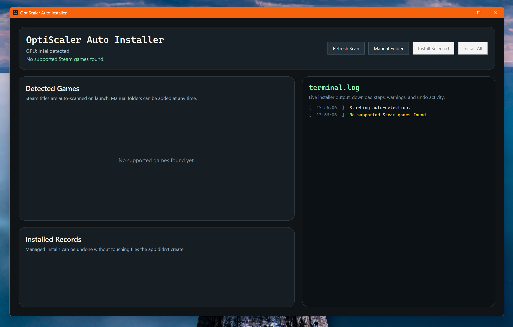

# OptiScaler Installer

Windows utility for automatically detecting supported games, downloading the latest stable OptiScaler release, installing it for you, and undoing the install later if needed.



## What It Does

- Detects your GPU vendor automatically: `Nvidia`, `AMD`, or `Intel`
- Scans Steam libraries for supported games
- Lets you pick one game or install to all detected supported games
- Supports manual folder selection for non-Steam games
- Downloads the latest stable OptiScaler release automatically (with retry and timeout)
- Falls back to a previously downloaded local cache when GitHub is unreachable
- Installs OptiScaler with safe proxy DLL selection
- Runs preflight checks (writability, locked files, disk space) before every install
- Keeps an install record so you can use `Undo`
- Writes a timestamped run log to `%LocalAppData%\OptiScalerInstaller\logs\`
- Shows live progress in a terminal-style log window
- Cancel button stops any in-progress scan, install, or undo

## Download

From the GitHub release page, download:

- `OptiScalerInstaller-win-x64.exe`

This is the main release artifact. No zip is required for normal use.

## How To Use

1. Download `OptiScalerInstaller-win-x64.exe` from the latest GitHub release.
2. Run the exe.
3. Wait for the app to scan your Steam libraries automatically.
4. If supported games are found:
   - leave the checked games selected
   - click `Install Selected` to install only checked games
   - or click `Install All` to install all detected supported games
5. If your game is not auto-detected, click `Manual Folder` and choose the game folder.
6. If the game is not officially supported, the app will warn you before allowing a manual override install.
7. Watch the terminal log on the right to see exactly what the installer is doing.
8. If you want to remove a managed install later, use the `Undo` button for that game.

## Important Notes

- The app downloads the latest stable OptiScaler release automatically when you install.
- If GitHub is unreachable, the installer transparently falls back to the most recently downloaded local cache (`%LocalAppData%\OptiScalerInstaller\cache\`).
- Before installing, the app verifies the game folder is writable, no target files are locked (game is not running), and there is at least 200 MB of free disk space.
- CPU does not matter for detection or install behavior here. Only the detected graphics vendor is used.
- If your system has both an Intel iGPU and an Nvidia GPU, the app will prefer showing `Nvidia`.
- Some games may be intentionally blocked from auto-install if they are marked unsafe.
- Manual override is available, but it is not officially supported and may not work for every game.
- Installing into protected folders such as `Program Files` may require administrator rights.
- Because the app is not code-signed yet, Windows SmartScreen may show a warning on first launch.
- Each run creates a log file under `%LocalAppData%\OptiScalerInstaller\logs\` for troubleshooting.
- Unhandled errors are caught globally and also written to the run log before reporting to the user.

## Undo

The installer keeps a manifest of files it created or replaced.

When you click `Undo`, it will:

- remove files created by the installer
- restore backed-up files that were replaced
- keep unrelated files untouched
- stage restore payload first and only delete backups after the restore fully succeeds

## Snapshot Recovery

- Every install now writes a transactional backup snapshot manifest to `%LocalAppData%\OptiScalerInstaller\state\backup-snapshots.json`.
- Snapshot state is independent from `installs.json`, so backup recovery still works if install state is missing or corrupted.
- Before mutating game files, the installer writes a `Pending` snapshot and records file-level metadata (created/replaced path, backup path, file sizes, SHA-256 hashes, release tag, proxy DLL, timestamps, and status).
- If install fails after backups begin, rollback runs automatically.
- On startup, the app detects pending/failed snapshots and prompts to recover them.

## Resilience

| Concern | Behaviour |
|---|---|
| GitHub unreachable | Retries up to 3× with exponential backoff (1 s → 2 s → 4 s) then falls back to the most recent local cache |
| Corrupted `installs.json` | Backed up as `installs.json.corrupted` and treated as empty so the app can still run |
| Atomic writes | Both `installs.json` and per-game manifests are written to a `.tmp` file first, then renamed, so a crash mid-write never corrupts state |
| Locked / in-use files | Preflight check detects locked target files before any download begins |
| Unwritable folder | Preflight check rejects the install immediately with a clear message |
| Low disk space | Preflight check requires ≥ 200 MB free on the install drive |
| Unhandled exceptions | Caught globally; written to the run log and shown to the user in a dialog |

## Current Scope

- Windows only
- Steam auto-detection
- Manual folder fallback
- Latest stable OptiScaler release only
- Bundled starter support catalog in [`data/supported-games.json`](data/supported-games.json)

## Roadmap

- Show game cover art after the app detects supported games
- Expand the bundled supported-game catalog
- Improve release packaging and signing
- Add launcher support beyond Steam

## Build From Source

```powershell
dotnet build OptiScalerInstaller.slnx
dotnet run --project .\src\OptiScalerInstaller.App\OptiScalerInstaller.App.csproj
```

## Test

```powershell
dotnet test OptiScalerInstaller.slnx
```
